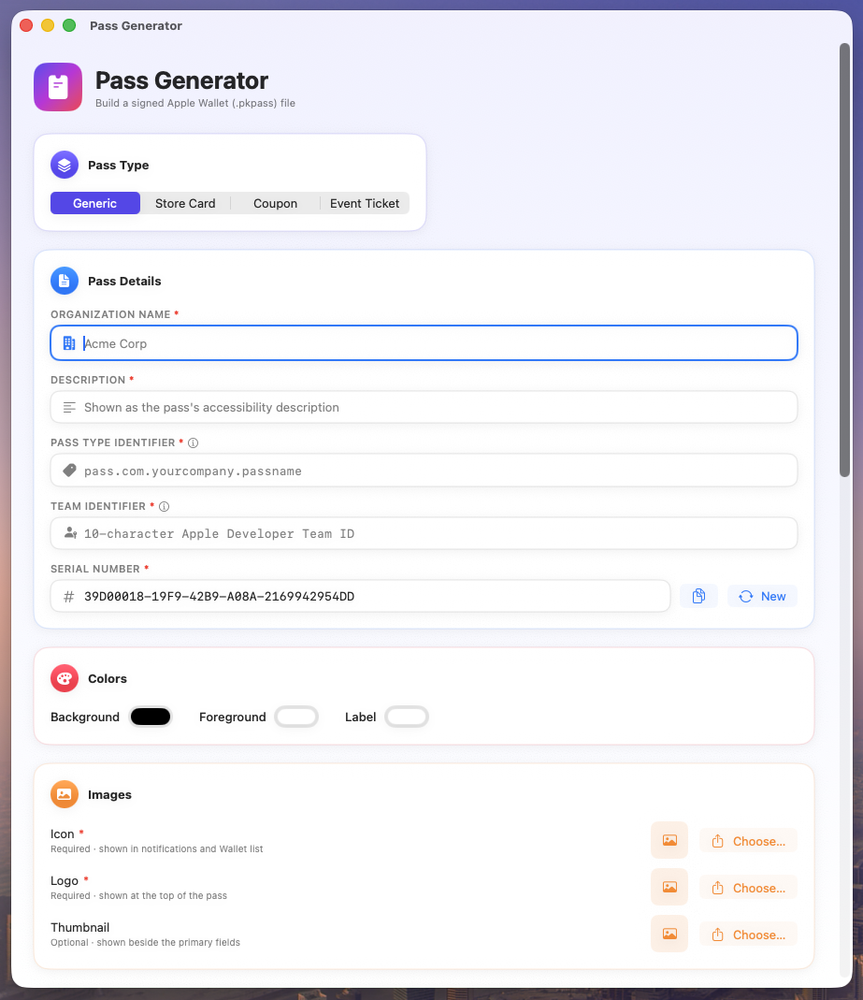

# Pass Generator

A native macOS app for building signed Apple Wallet (`.pkpass`) files — no command line, no
scripts. Fill in a form, upload your certificates and artwork, and get back a valid, signed pass
ready to add to Wallet.

Built with SwiftUI. Signing uses macOS's own `Security.framework` (`CMSEncoder`) directly, so
there's no OpenSSL dependency and no server involved — everything happens locally on your Mac.

## Screenshot



## Features

- **Four pass styles**: Generic, Store Card, Coupon, and Event Ticket.
- **All the standard pass fields**: organization name, description, pass type identifier, team
  identifier, serial number (with one-click regenerate and copy), background/foreground/label
  colors.
- **Custom field editor** for header, primary, secondary, auxiliary, and back fields — add or
  remove rows freely.
- **Images**: icon and logo (required), strip and thumbnail (optional, shown only for the pass
  styles that use them).
- **Barcode support**: QR Code, PDF417, Aztec, or Code 128, with message and optional alt text.
- **In-app signing**: upload your Pass Type ID certificate (`.p12`, with or without a password)
  and Apple's WWDR intermediate certificate directly in the form — both DER (`.cer`) and PEM
  certificate formats are accepted for the WWDR cert.
- **Built-in documentation links**: an ⓘ next to the fields that map to Apple's own PassKit
  documentation (Pass Type Identifier, Team Identifier, and both certificate fields) opens the
  relevant Apple Developer page.
- One click **Generate .pkpass…** — builds `pass.json`, stages the image files, computes the
  manifest, signs it, zips it, and lets you pick where to save the result.

## Installation

Install via Homebrew:

```bash
brew install souvickcse/tap/pass-generator
```

This taps [souvickcse/homebrew-tap](https://github.com/souvickcse/homebrew-tap) automatically
and installs the app to `/Applications`.

> **A note on Gatekeeper**: this build is signed with a personal Apple Developer certificate,
> not a notarized Developer ID (that requires a paid Apple Developer Program membership). The
> Homebrew Cask clears the quarantine flag on install, so it launches normally with no extra
> steps. If you ever get the `.app` some other way (not via Homebrew), you may need to
> right-click → Open the first time, or run `xattr -cr "/Applications/Pass Generator.app"`.

**Updating:**

```bash
brew upgrade souvickcse/tap/pass-generator
```

**Uninstalling:**

```bash
brew uninstall --cask souvickcse/tap/pass-generator
```

## Requirements

- macOS 13 or later
- [Xcode](https://developer.apple.com/xcode/) (to build from source)
- [XcodeGen](https://github.com/yonaskolb/XcodeGen) — `brew install xcodegen`

## Building from source

Only needed if you want to build the app yourself instead of installing via Homebrew.

```bash
brew install xcodegen   # one-time
xcodegen generate
open PassGenerator.xcodeproj
```

Then build and run from Xcode (⌘R), or from the command line:

```bash
xcodebuild -project PassGenerator.xcodeproj -scheme PassGenerator -configuration Debug -destination 'platform=macOS' build
```

No third-party dependencies — everything is built on Apple's own frameworks (SwiftUI,
`Security`, `CryptoKit`) plus the system `/usr/bin/zip` for packaging.

## Before you start: what you'll need

Generating a real, Wallet-installable pass requires two things from Apple that this app can't
create for you:

1. **A Pass Type ID certificate**, exported as a `.p12` file. Create a Pass Type ID under
   [Certificates, Identifiers & Profiles](https://developer.apple.com/account/resources/certificates/list)
   in your Apple Developer account, generate its certificate, then export it from Keychain
   Access as a `.p12` (a password is optional).
2. **Apple's WWDR intermediate certificate**, downloadable from
   [Apple's certificate authority page](https://www.apple.com/certificateauthority/).

Both requirements are a normal part of Apple's Wallet Passes program and apply no matter how the
pass is built — this app just removes the need to hand-write `pass.json`, compute the manifest,
and shell out to `openssl` yourself.

## Usage

1. Launch **Pass Generator**.
2. Pick a **Pass Type** (Generic, Store Card, Coupon, or Event Ticket).
3. Fill in **Pass Details** — organization name, description, your Pass Type Identifier, Team
   Identifier, and serial number (a random one is pre-filled; regenerate or copy it as needed).
4. Choose **Colors** for the background, foreground, and label text.
5. Upload **Images** — icon and logo are required; strip/thumbnail appear only for pass styles
   that use them.
6. Add any **Fields** you want shown on the front or back of the pass.
7. Configure a **Barcode**, if you want one, with its format and encoded message.
8. Under **Signing Certificates**, upload your `.p12` (with its password, if it has one) and the
   WWDR certificate.
9. Click **Generate .pkpass…**, then choose where to save the file.
10. AirDrop the `.pkpass` to an iPhone, or open it directly on the Mac — it'll offer to add
    itself to Wallet.

## How it works

- **`pass.json`** is built directly from your form input, respecting the selected pass style's
  field groups.
- **`manifest.json`** lists the SHA-1 hash of every file in the pass bundle.
- **Signing** uses `CMSEncoder` (part of `Security.framework`) to produce a detached CMS/PKCS#7
  signature over the manifest — the same signature format Apple's own tooling produces, just
  without needing OpenSSL.
- **Packaging** shells out to the system's `/usr/bin/zip` to produce the final flat-layout
  `.pkpass` archive, exactly as Apple's own documentation describes.

## License

MIT — free to use, modify, and distribute. See [LICENSE](LICENSE).
